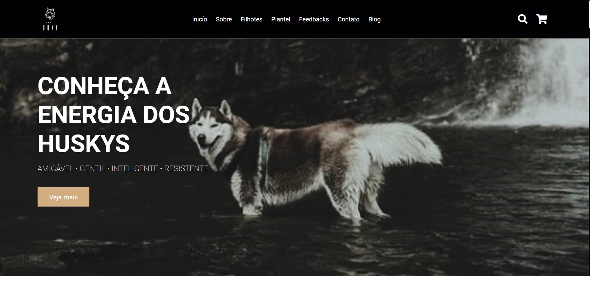

<h1 align="center"><b>Landing Page: CanilDuke</b></h1>
<h1 align="center"></h1>
<h1 >📚  Sobre</h1>

 Landing page em desenvlvimento para amostra de exemplares dos filhotes do Canil Duke (MG)

 

<h1 >🚀  Tecnologias utilizadas</h1>
✔️ HTML5  
✔️ CSS3  
✔️ Javascript 
 

---

<h1> 📠Licença </h1> 

- Esse projeto está sob a licença MIT. Veja o arquivo [LICENSE](https://github.com/LuSilva710/CanilDuke/blob/5e333f8b5a51d7ab2590b4cea8ba8a324f6c6273/LICENCE.md) para mais detalhes.

---
Copyright (c) 2023  
Feito com ♥ by @Lu Silva :wave:

---
<h1> Contato </h1> 

  

